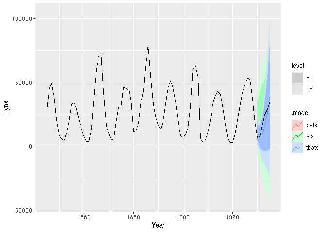

<!-- README.md is generated from README.Rmd. Please edit that file -->

# fable.tbats

<!-- badges: start -->

[](https://github.com/JSzitas/fable.tbats/actions)
[](https://codecov.io/gh/JSzitas/autodep?branch=main)
[](https://lifecycle.r-lib.org/articles/stages.html#stable)
[](https://CRAN.R-project.org/package=fable.tbats)
<!-- badges: end -->

fable.tbats is a wrapper around the implementation of **tbats** from the
[forecast](https://github.com/robjhyndman/forecast) package. This
integrates seamlessly, and can be used just like any model in **fable**:

``` r
library(tsibbledata)
library(fable)
library(fable.tbats)
library(dplyr)

# fit models to the pelt dataset until 1930:
train <- pelt %>% 
  filter(Year < 1930)
test <- pelt %>% 
  filter(Year >= 1930)

models <- train %>% 
  model( ets = ETS(Lynx),
         bats = BATS(Lynx),
         tbats = TBATS(Lynx)
         ) 
forecasts <- forecast(models, test)

autoplot(forecasts, pelt)
```



Similarly, accuracy calculation works:

``` r
train_accuracies <- accuracies <- accuracy(models)
knitr::kable(train_accuracies)
```

| .model | .type    |        ME |     RMSE |      MAE |        MPE |     MAPE |      MASE |     RMSSE |      ACF1 |
|:-------|:---------|----------:|---------:|---------:|-----------:|---------:|----------:|----------:|----------:|
| ets    | Training | -77.59902 | 12891.89 | 9824.778 | -20.073965 | 52.20456 | 0.9934890 | 0.9948210 | 0.5352087 |
| bats   | Training | 936.16014 |  7884.54 | 5667.879 |  -7.236549 | 27.18220 | 0.5731402 | 0.6084217 | 0.1853953 |
| tbats  | Training | 936.16014 |  7884.54 | 5667.879 |  -7.236549 | 27.18220 | 0.5731402 | 0.6084217 | 0.1853953 |

``` r
test_accuracies <- accuracy(forecasts, test)
knitr::kable(test_accuracies)
```

| .model | .type |       ME |      RMSE |      MAE |        MPE |     MAPE | MASE | RMSSE |      ACF1 |
|:-------|:------|---------:|----------:|---------:|-----------:|---------:|-----:|------:|----------:|
| bats   | Test  | 1649.878 |  5308.609 | 4495.617 |   3.225424 | 25.50999 |  NaN |   NaN | 0.2442253 |
| ets    | Test  | 1061.473 | 10669.984 | 9770.000 | -36.632392 | 71.41690 |  NaN |   NaN | 0.5558575 |
| tbats  | Test  | 1649.878 |  5308.609 | 4495.617 |   3.225424 | 25.50999 |  NaN |   NaN | 0.2442253 |

As does refitting:

``` r
models <- refit( models, pelt )
```

Of the functionality available in the **forecast** package, only
**forecast::tbats.components()** is missing.

## Performance note

Fitting bats/tbats to a few long series can (potentially) be slower
using this wrapper than using the forecast package. This is due to the
fact that the internal tbats/bats algorithm always executes sequentially
(i.e. with **use.parallel = FALSE** ) to prevent issues with nested
parallelism (as the **fabletools::model** function is taken to be
responsible for handling parallelization).

This should never be a problem on many time series, but does lead to a
significant slow-down if you are only modelling a single/few time
series. Nonetheless, in those cases the
[fasster](https://github.com/tidyverts/fasster) package might be much
better suited for your use case anyways.

## Installation

Currently only:

``` r
pak::pkg_install("JSzitas/fable.tbats")
```
