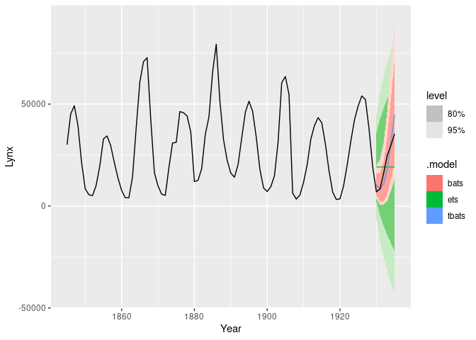
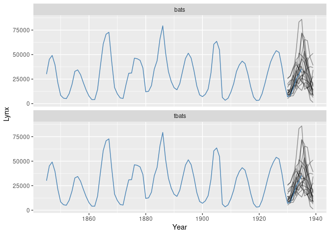

<!-- README.md is generated from README.Rmd. Please edit that file -->

# fable.tbats

<!-- badges: start -->

[](https://github.com/JSzitas/fable.tbats/actions)
[](https://github.com/JSzitas/fable.tbats/actions/workflows/test-coverage.yaml)
[](https://lifecycle.r-lib.org/articles/stages.html#stable)
[](https://CRAN.R-project.org/package=fable.tbats)
<!-- badges: end -->

**fable.tbats** provides the BATS and TBATS models of De Livera, Hyndman
and Snyder (2011) for **fable**. The fitting is implemented in C++
inside the package (a single, dependency-free header,
`src/tbats/tbats.h`, designed in `src/tbats/DESIGN.md`); it began as a
wrapper around the [forecast](https://github.com/robjhyndman/forecast)
package’s implementation, against which it is verified.

## Installation

``` r
pak::pkg_install("JSzitas/fable.tbats")
```

## Usage

Used just like any model in **fable**:

``` r
library(tsibbledata)
library(fable)
library(fable.tbats)
library(dplyr)

# fit models to the pelt dataset until 1930:
train <- pelt %>% 
  filter(Year < 1930)
test <- pelt %>% 
  filter(Year >= 1930)

models <- train %>% 
  model( ets = ETS(Lynx),
         bats = BATS(Lynx),
         tbats = TBATS(Lynx)
         ) 
# generate forecasts on the test set
forecasts <- forecast(models, test)
# visualize
autoplot(forecasts, pelt)
```



Similarly, accuracy calculation works:

``` r
train_accuracies <- accuracy(models)
knitr::kable(train_accuracies)
```

| .model | .type    |         ME |     RMSE |      MAE |         MPE |     MAPE |     MASE |     RMSSE |      ACF1 |
| :----- | :------- | ---------: | -------: | -------: | ----------: | -------: | -------: | --------: | --------: |
| ets    | Training | \-77.59902 | 12891.89 | 9824.778 | \-20.073965 | 52.20456 | 0.993489 | 0.9948210 | 0.5352087 |
| bats   | Training |  690.54347 |  7463.20 | 5334.552 |  \-8.142754 | 27.43139 | 0.539434 | 0.5759084 | 0.1237459 |
| tbats  | Training |  690.54347 |  7463.20 | 5334.552 |  \-8.142754 | 27.43139 | 0.539434 | 0.5759084 | 0.1237459 |

``` r
test_accuracies <- accuracy(forecasts, test)
knitr::kable(test_accuracies)
```

| .model | .type |        ME |      RMSE |      MAE |         MPE |     MAPE | MASE | RMSSE |      ACF1 |
| :----- | :---- | --------: | --------: | -------: | ----------: | -------: | ---: | ----: | --------: |
| bats   | Test  | \-428.427 |  5237.774 | 4248.271 |  \-3.644561 | 22.81582 |  NaN |   NaN | 0.2483518 |
| ets    | Test  |  1061.473 | 10669.984 | 9770.000 | \-36.632392 | 71.41690 |  NaN |   NaN | 0.5558575 |
| tbats  | Test  | \-428.427 |  5237.774 | 4248.271 |  \-3.644561 | 22.81582 |  NaN |   NaN | 0.2483518 |

## Simulation

Simulated future sample paths are available through **generate()**.
Innovations are drawn from a normal distribution with the fitted
variance by default, or resampled from the innovation residuals with
**bootstrap = TRUE**:

``` r
paths <- models %>%
  select(bats, tbats) %>%
  generate(h = "10 years", times = 20, seed = 1)
paths
#> # A tsibble: 400 x 4 [1Y]
#> # Key:       .model, .rep [40]
#>    .model .rep   Year   .sim
#>    <chr>  <chr> <dbl>  <dbl>
#>  1 bats   1      1930  7425.
#>  2 bats   1      1931  5313.
#>  3 bats   1      1932  4941.
#>  4 bats   1      1933 18748.
#>  5 bats   1      1934 42231.
#>  6 bats   1      1935 52209.
#>  7 bats   1      1936 59523.
#>  8 bats   1      1937 56971.
#>  9 bats   1      1938 44430.
#> 10 bats   1      1939 24249.
#> # ℹ 390 more rows
```

``` r
library(ggplot2)
paths %>%
  ggplot(aes(x = Year, y = .sim, group = .rep)) +
  geom_line(alpha = 0.4) +
  geom_line(aes(y = Lynx, group = NULL), data = pelt, colour = "steelblue") +
  facet_wrap(~ .model, ncol = 1) +
  labs(y = "Lynx")
```



``` r
bootstrapped <- models %>%
  select(tbats) %>%
  generate(h = "10 years", times = 20, bootstrap = TRUE, seed = 1)
```

Note that **residuals()** returns the innovation residuals of the state
space model by default, which are on the Box-Cox transformed scale when
a Box-Cox transformation is used. Residuals on the scale of the data are
available with **type = “response”**.

## Refitting

Refitting to new data works as well:

``` r
models <- refit( models, pelt )
```

### A note on refitting

`refit()` deliberately departs from the forecast package. With the
default `reestimate = FALSE` the estimated parameters are kept and only
the seed states (the state vector before the first observation) are
re-estimated for the new series, because the stored seed states describe
the origin of the training series and nothing else. The forecast package
reuses them unchanged, which is only right when the new series starts at
the same origin. With `reestimate = TRUE` the full model search is
repeated on the new data.

## Components

The level, the slope and one seasonal effect per period are available as
a dable, on the Box-Cox transformed scale when the model uses a
transformation:

``` r
models %>%
  select(tbats) %>%
  components()
#> # A dable: 91 x 5 [1Y]
#> # Key:     .model [1]
#> # :        Lynx = NULL
#>    .model  Year  Lynx level remainder
#>    <chr>  <dbl> <dbl> <dbl>     <dbl>
#>  1 tbats   1845 30090  133.     22.7 
#>  2 tbats   1846 45150  141.     22.3 
#>  3 tbats   1847 49150  149.      6.22
#>  4 tbats   1848 39520  153.     -2.13
#>  5 tbats   1849 21230  149.    -13.4 
#>  6 tbats   1850  8420  138.    -14.4 
#>  7 tbats   1851  5560  127.      1.54
#>  8 tbats   1852  5080  117.    -10.5 
#>  9 tbats   1853 10170  114.      1.16
#> 10 tbats   1854 19600  116.     -5.00
#> # ℹ 81 more rows
```

## Performance note

The model search runs sequentially; **fabletools::model** is responsible
for parallelising across series. Like for like (sequential on both
sides), the C++ implementation is 3 to 20 times faster than the forecast
package’s on series from 72 to 5000 observations, with an equal or lower
AIC in every case; `experiments/benchmark_port.R` reproduces the
comparison against the implementation this package carried up to version
0.5.0.
