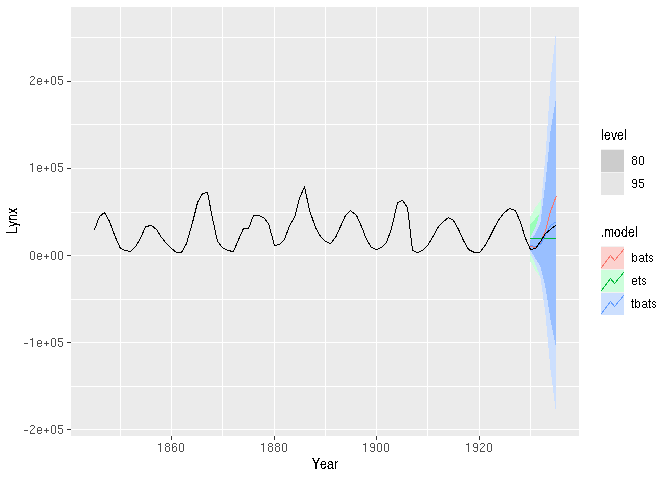

<!-- README.md is generated from README.Rmd. Please edit that file -->

# fable.tbats

<!-- badges: start -->

[](https://github.com/JSzitas/fable.tbats/actions)
[](https://codecov.io/gh/JSzitas/fable.tbats?branch=main)
[](https://lifecycle.r-lib.org/articles/stages.html#stable)
[](https://CRAN.R-project.org/package=fable.tbats)
<!-- badges: end -->

**fable.tbats** is a wrapper around the implementation of **tbats**
originally from the [forecast](https://github.com/robjhyndman/forecast)
package, though it now works without this dependency.

## Installation

``` r
pak::pkg_install("JSzitas/fable.tbats")
```

## Usage

Used just like any model in **fable**:

``` r
library(tsibbledata)
library(fable)
library(fable.tbats)
library(dplyr)

# fit models to the pelt dataset until 1930:
train <- pelt %>% 
  filter(Year < 1930)
test <- pelt %>% 
  filter(Year >= 1930)

models <- train %>% 
  model( ets = ETS(Lynx),
         bats = BATS(Lynx),
         tbats = TBATS(Lynx)
         ) 
# generate forecasts on the test set
forecasts <- forecast(models, test)
# visualize
autoplot(forecasts, pelt)
```



Similarly, accuracy calculation works:

``` r
train_accuracies <- accuracy(models)
knitr::kable(train_accuracies)
```

| .model | .type    |         ME |      RMSE |      MAE |        MPE |     MAPE |      MASE |     RMSSE |      ACF1 |
|:-------|:---------|-----------:|----------:|---------:|-----------:|---------:|----------:|----------:|----------:|
| ets    | Training |  -77.59902 | 12891.891 | 9824.778 | -20.073965 | 52.20456 | 0.9934890 | 0.9948210 | 0.5352087 |
| bats   | Training | 1768.39519 |  8540.088 | 6105.791 |  -2.816831 | 27.18703 | 0.6174222 | 0.6590080 | 0.1656173 |
| tbats  | Training | 1653.48581 |  7955.411 | 5577.862 |  -3.003260 | 26.36744 | 0.5640376 | 0.6138906 | 0.0367109 |

``` r
test_accuracies <- accuracy(forecasts, test)
knitr::kable(test_accuracies)
```

| .model | .type |         ME |      RMSE |       MAE |       MPE |     MAPE | MASE | RMSSE |      ACF1 |
|:-------|:------|-----------:|----------:|----------:|----------:|---------:|-----:|------:|----------:|
| bats   | Test  | -10363.643 | 16253.210 | 10829.331 | -40.43004 | 43.33877 |  NaN |   NaN | 0.4460149 |
| ets    | Test  |   1061.473 | 10669.984 |  9770.000 | -36.63239 | 71.41690 |  NaN |   NaN | 0.5558575 |
| tbats  | Test  |  -1898.560 |  3444.412 |  3208.959 | -16.86434 | 24.23634 |  NaN |   NaN | 0.1667398 |

As does refitting:

``` r
models <- refit( models, pelt )
```

Of the functionality available in the **forecast** package, only
**forecast::tbats.components()** is missing.

## Performance note

Fitting bats/tbats to a few long series can (potentially) be slower
using this wrapper than using the forecast package. This is due to the
fact that the internal tbats/bats algorithm always executes sequentially
(i.e. with **use.parallel = FALSE** ) to prevent issues with nested
parallelism (as the **fabletools::model** function is taken to be
responsible for handling parallelization).

This should never be a problem on many time series, but does lead to a
significant slow-down if you are only modelling a single/few time
series. Nonetheless, in those cases the
[fasster](https://github.com/tidyverts/fasster) package might be much
better suited for your use case anyways.
